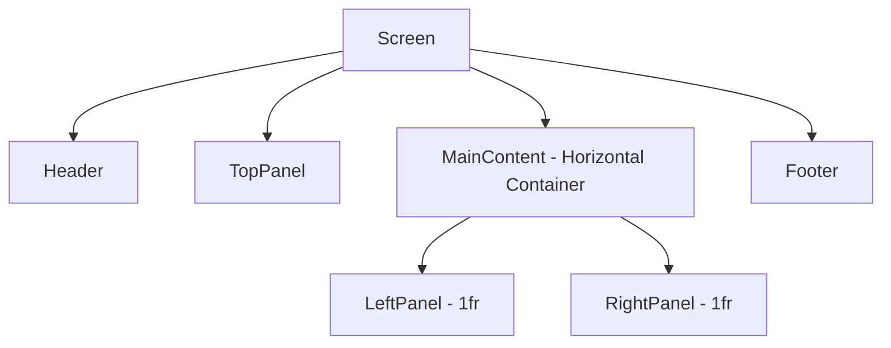

# Template UI Layout Plan

A basic UI scaffold built with Textual framework.

## Layout Structure

```
+====================================================+
|                      HEADER                        |  <-- dock:top; tall: False
+====================================================+
|                                                    |
|                  PANEL                             |  <-- dock: top
|                                                    |
+==========================+=========================+
|                          |                         |
|                          |                         |
|       LEFT PANEL         |      RIGHT PANEL        |  <-- 50/50 split
|         (50%)            |        (50%)            |
|                          |                         |
|                          |                         |
+==========================+=========================+
|                      FOOTER                        |  <-- dock: bottom
+====================================================+
```

## Architecture Overview

### File Structure

```
textular-experiments/
    app.py              # Main application entry point
    styles.tcss         # Textual CSS stylesheet
    plans/
        template-ui-plan.md
```

### Component Hierarchy



## Implementation Details

### 1. Main Application - app.py

The main application will:
- Subclass `textual.app.App`
- Define `CSS_PATH` pointing to `styles.tcss`
- Set `TITLE` and `SUB_TITLE` for the Header widget
- Use `compose()` method to yield widgets in order

**Widget Yield Order:**
1. `Header(show_clock=True)` - built-in Textual Header widget
2. `TopPanel()` - custom Static widget for the top panel area
3. `Horizontal()` container with:
   - `LeftPanel()` - custom Static widget
   - `RightPanel()` - custom Static widget
4. `Footer()` - built-in Textual Footer widget

### 2. Stylesheet - styles.tcss

**Key Styling Rules:**

| Widget | CSS Properties |
|--------|----------------|
| Header | `dock: top;` `tall: false;` - built-in defaults |
| TopPanel | `dock: top;` `height: auto;` or fixed height |
| Horizontal | `height: 1fr;` - fills remaining space |
| LeftPanel | `width: 1fr;` - 50% of horizontal space |
| RightPanel | `width: 1fr;` - 50% of horizontal space |
| Footer | `dock: bottom;` - built-in default |

### 3. Custom Widgets

Simple placeholder widgets extending `Static`:

```python
class TopPanel(Static):
    pass

class LeftPanel(Static):
    pass

class RightPanel(Static):
    pass
```

## CSS Layout Strategy

Using Textual CSS with:
- **Docking** for Header and Footer to pin them to edges
- **Vertical layout** on Screen for top-down flow - this is the default
- **Horizontal container** for the 50/50 split using `fr` units
- **Height: 1fr** on the Horizontal container to fill remaining space

## Implementation Checklist

- [ ] Create `app.py` with App class and compose method
- [ ] Create `styles.tcss` with layout rules
- [ ] Define TopPanel, LeftPanel, RightPanel as Static widgets
- [ ] Add border styling for visual debugging
- [ ] Test with `python app.py`

