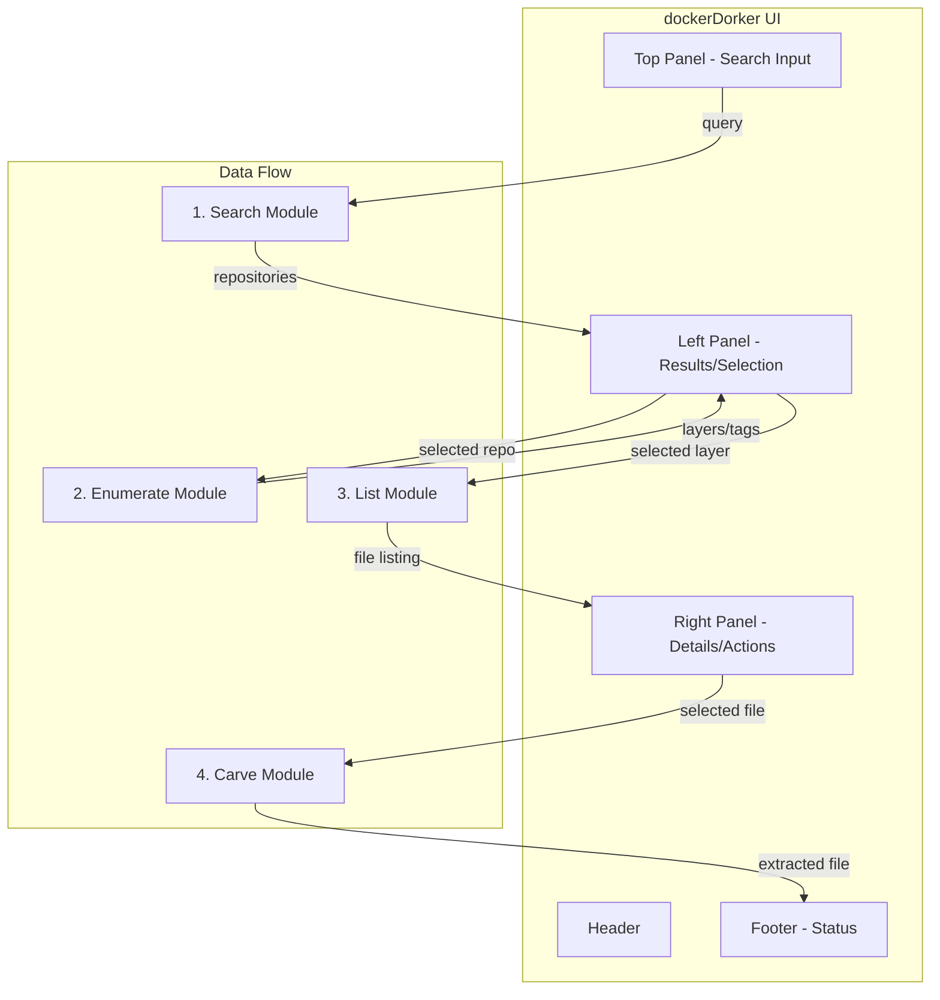

# Refactoring Plan: Template UI to Submodule Integration

## Status

| Step | Description | Status |
|------|-------------|--------|
| Step 1 | Refactor App Layout | COMPLETE |
| Step 2 | Spider Codebase | COMPLETE |
| Step 3 | Wire in Submodules | PENDING |

**Last Updated:** 2025-01-19

---

## Overview

Refactor the standalone scripts into a cohesive application that recreates the docker-dorker workflow without technical debt.

**Core Flow:** Search -> Enumerate Tags -> List Files -> Carve

---

## Current State Analysis

### Current Directory Structure

```
textular-experiments/
├── app.py                          # Main entry point - basic Textual UI
├── styles.tcss                     # UI styling
├── TODO.md                         # Legacy notes
├── app/
│   ├── database/                   # Empty - TODO: migrate DB code
│   ├── modules/
│   │   ├── search/
│   │   │   └── search-docker-hub.py    # Standalone Docker Hub search
│   │   ├── enumerate/
│   │   │   └── list_dockerhub_container_files.py  # Lists files in containers
│   │   ├── carve/
│   │   │   ├── carve-file-from-layer.py  # Extracts files from layers
│   │   │   └── src/                      # Shared code - WRONG LOCATION
│   │   │       ├── api/
│   │   │       │   ├── layerslayer/
│   │   │       │   │   ├── parser.py     # Tar header parser
│   │   │       │   │   └── fetcher.py    # HTTP Range fetcher
│   │   │       │   └── dockerhub_*.py    # DockerHub API functions
│   │   │       └── database.py           # Database operations
│   │   └── styles/                       # Unused
```

### Current Problems

1. **Import Path Issues**: Modules use `sys.path.insert(0, str(Path(__file__).parent.parent))` which expects `src/` at `app/modules/src/` but it is at `app/modules/carve/src/`

2. **No Shared Code Location**: The `src/` folder is nested inside `carve/` but used by multiple modules

3. **Standalone Scripts**: Each module runs independently with no UI integration

4. **No Flow Connection**: Modules do not communicate or pass data between steps

---

## Target State

### Target Directory Structure

```
textular-experiments/
├── app.py                          # Main entry point - orchestrates UI
├── styles.tcss                     # UI styling
├── app/
│   ├── __init__.py                 # Package init
│   ├── core/                       # SHARED CODE - NEW LOCATION
│   │   ├── __init__.py
│   │   ├── database.py             # Shared database operations
│   │   ├── api/
│   │   │   ├── __init__.py
│   │   │   ├── registry.py         # Docker registry authentication
│   │   │   ├── dockerhub_search.py # DockerHub search API
│   │   │   ├── dockerhub_fetch.py  # DockerHub fetch operations
│   │   │   ├── dockerhub_parse.py  # Response parsing
│   │   │   └── dockerhub_v2_api.py # V2 API operations
│   │   └── utils/
│   │       ├── __init__.py
│   │       ├── tar_parser.py       # Tar header parsing - from parser.py
│   │       ├── layer_fetcher.py    # HTTP Range requests - from fetcher.py
│   │       └── formatters.py       # Output formatting utilities
│   ├── modules/
│   │   ├── __init__.py
│   │   ├── search/
│   │   │   ├── __init__.py
│   │   │   ├── widget.py           # Textual widget for search UI
│   │   │   └── search.py           # Search logic - refactored
│   │   ├── enumerate/
│   │   │   ├── __init__.py
│   │   │   ├── widget.py           # Textual widget for enumeration UI
│   │   │   └── enumerate.py        # Enumeration logic - refactored
│   │   ├── list/
│   │   │   ├── __init__.py
│   │   │   ├── widget.py           # Textual widget for file list UI
│   │   │   └── list_files.py       # File listing logic
│   │   └── carve/
│   │       ├── __init__.py
│   │       ├── widget.py           # Textual widget for carve UI
│   │       └── carve.py            # File extraction logic - refactored
│   └── ui/
│       ├── __init__.py
│       ├── panels.py               # Reusable panel components
│       └── layout.py               # Layout management
├── data/                           # Runtime data
│   ├── cache/                      # Layer cache
│   └── output/                     # Carved files output
└── plans/
    └── in-progress/
        └── refactor-to-submodules-plan.md  # This file
```

---

## Implementation Steps

### Step 1: Refactor App Layout and Update File References

#### 1.1 Create app/core/ Directory Structure

Create the new shared code location:

```
app/core/
├── __init__.py
├── database.py
├── api/
│   ├── __init__.py
│   └── ... API modules
└── utils/
    ├── __init__.py
    └── ... utility modules
```

#### 1.2 Move Shared Code from app/modules/carve/src/ to app/core/

| Source | Destination |
|--------|-------------|
| `app/modules/carve/src/database.py` | `app/core/database.py` |
| `app/modules/carve/src/api/layerslayer/parser.py` | `app/core/utils/tar_parser.py` |
| `app/modules/carve/src/api/layerslayer/fetcher.py` | `app/core/utils/layer_fetcher.py` |
| `app/modules/carve/src/api/dockerhub_*.py` | `app/core/api/` |
| `app/modules/carve/src/utils/*.py` | `app/core/utils/` |

#### 1.3 Update All Module Imports

Update import statements in:
- `app/modules/search/search-docker-hub.py`
- `app/modules/enumerate/list_dockerhub_container_files.py`
- `app/modules/carve/carve-file-from-layer.py`

Change from:
```python
sys.path.insert(0, str(Path(__file__).parent.parent))
from src.api.layerslayer.parser import TarEntry, parse_tar_header
```

To:
```python
from app.core.utils.tar_parser import TarEntry, parse_tar_header
```

#### 1.4 Update app.py Structure

Ensure the main app imports work with the new structure.

#### 1.5 Verify Each Script Still Works

**Critical: Each script must be tested after refactoring to ensure it still functions.**

##### 1.5.1 Test Search Module

```bash
# From workspace root
python app/modules/search/search-docker-hub.py disney
```

Expected output:
- Searches Docker Hub for "disney"
- Prints formatted table with Type, Fav, Pulls, Name, Desc columns
- Shows "Complete: X results" message

##### 1.5.2 Test Enumerate Module

```bash
# From workspace root
python app/modules/enumerate/list_dockerhub_container_files.py ubuntu:24.04
```

Expected output:
- Lists files in ubuntu:24.04 container
- Shows layer scanning progress
- Prints file listing with Layer, Type, Mode, Size, Path columns
- Shows summary with efficiency stats

##### 1.5.3 Test Carve Module

```bash
# From workspace root
python app/modules/carve/carve-file-from-layer.py ubuntu:24.04 /etc/passwd
```

Expected output:
- Fetches manifest for ubuntu:24.04
- Scans layers for /etc/passwd
- Extracts and saves file
- Shows "Done! File saved to: etc/passwd"
- Shows download efficiency stats

##### 1.5.4 Test Main App

```bash
# From workspace root
python app.py
```

Expected output:
- Textual TUI launches with Dracula theme
- Shows Header, Top Panel, Left/Right Panels, Footer
- No import errors

---

### Step 2: Spider Codebase and Index Permanent Layout

#### 2.1 Document Final Directory Structure

Create a `STRUCTURE.md` file documenting the permanent layout.

#### 2.2 Create Module Index/Map

Document each module with:
- Purpose
- Inputs
- Outputs
- Dependencies

#### 2.3 Verify All Imports Work Correctly

Run tests to ensure no import errors.

---

### Step 3: Wire in Submodules for Docker-Dorker Flow

#### Flow Diagram



#### 3.1 Integrate Search Module into UI

- Create `SearchWidget` that wraps search functionality
- Display search input in Top Panel
- Show search results in Left Panel
- Handle repository selection

#### 3.2 Integrate Enumerate Module

- Create `EnumerateWidget` for tag/layer enumeration
- Triggered when user selects a repository from search
- Display available tags and layers
- Handle layer selection

#### 3.3 Integrate List Module

- Create `ListWidget` for file system display
- Triggered when user selects a layer
- Display files in tree or list format
- Handle file selection for carving

#### 3.4 Integrate Carve Module

- Create `CarveWidget` for file extraction
- Triggered when user selects a file to extract
- Show extraction progress
- Display result/save location

#### 3.5 Connect the Flow Between Modules

- Implement message passing between widgets
- Add state management for selection context
- Create unified data model for passing between steps

---

## UI Layout Design

### Panel Responsibilities

| Panel | Purpose | Content |
|-------|---------|---------|
| Header | App title/info | dockerDorker title, clock |
| Top Panel | Search interface | Search input, filters |
| Left Panel | Navigation/Selection | Search results, tags, layers tree |
| Right Panel | Details/Preview | File listing, file preview, actions |
| Footer | Status/Actions | Progress, status messages, keybindings |

### Key Bindings

| Key | Action |
|-----|--------|
| `/` | Focus search |
| `Enter` | Select item |
| `Tab` | Switch panels |
| `c` | Carve selected file |
| `q` | Quit |

---

## Migration Strategy

1. **Phase 1 - Structure**: Create new directories and move files without changing functionality
2. **Phase 2 - Imports**: Update all import statements
3. **Phase 3 - Widgets**: Create Textual widgets for each module
4. **Phase 4 - Integration**: Wire widgets together in the main app
5. **Phase 5 - Polish**: Add error handling, progress indicators, caching

---

## Notes

- Do not delete original files until migration is verified
- Keep backward compatibility where possible
- Each step should result in a working application
- Use the user instruction: Keep it simple!
