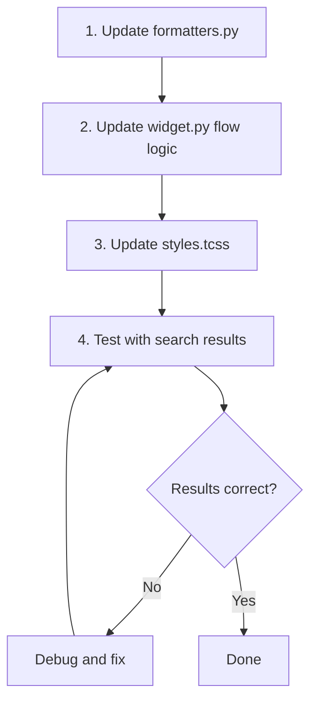

# Plan: Fix Search Results Grid

## Overview

The search results grid in the left panel has several issues that need to be corrected to match the expected format and behavior.

## Key Requirement: Synchronized Column Scrolling

The 4-column grid must scroll as a **single unified slab** - all columns scroll together vertically, keeping rows horizontally aligned at all times. This means:

- Row items 1, 5, 9, 13 stay aligned horizontally
- Row items 2, 6, 10, 14 stay aligned horizontally
- And so on...

The current DataTable implementation supports this naturally since it is a single widget. The fix is about changing the **fill order** from row-first to column-first while maintaining the synchronized scrolling behavior.

## Current vs Expected Behavior

### Expected Layout Flow

The grid should flow **top-to-bottom first, then left-to-right** with vertical scrolling:

```
Column 1    Column 2    Column 3    Column 4
   1           5           9          13
   2           6          10          14
   3           7          11          15
   4           8          12          16
   |           |           |           |
   v           v           v           v
  scroll     scroll      scroll     scroll # Scroll should be syncronized so that they're horizontally aligned while they scroll vertically.

  Scrolling would keep:
    - 1, 5, 9, and 13 in alignment
    - 2, 6, 10, and 14 in alignment
    - 3, 7, 11, annd 15, and so on, so tht as a I scroll, they move as a single "slab"
```

### Current Layout Flow (INCORRECT)

Currently fills **left-to-right first, then top-to-bottom**:

```
Row 1:   1    2    3    4
Row 2:   5    6    7    8
Row 3:   9   10   11   12
         |
         v
       scroll
```

### Expected Card Format

```
+-------------------------+
| mdpdisney/openpose      |  <- Row 1: owner/repo (bold, ellipsis)
| LastPushed: 12/12/2026  |  <- Row 2: LastPushed date
| * 69 pulls: 666         |  <- Row 3: stars and pulls
| OpenPose 2017-08-08...  |  <- Row 4: description (italic, ellipsis)
+-------------------------+
```

### Current Card Format (INCORRECT)

```
+-------------------------+
| display_name            |  <- Row 1: OK
| Updated: 2024-01-01     |  <- Row 2: WRONG - says "Updated:" not "LastPushed:"
| * 69 Pulls: 666         |  <- Row 3: WRONG - "Pulls:" should be "pulls:"
| Description text...     |  <- Row 4: OK
+-------------------------+
```

## Files to Modify

### 1. `app/ui/widgets/search_results/widget.py`

**Problem:** The `_populate_grid()` method fills rows left-to-right.

**Solution:** Restructure to fill columns top-to-bottom. This requires calculating how many rows fit in the visible area and distributing results across 4 columns.

```python
# Current approach - fills by row
for i in range(0, len(results), 4):
    row = results[i:i+4]
    add_row(*row)

# New approach - fill by column
# Calculate items per column based on total results
items_per_column = ceil(len(results) / 4)
for row_idx in range(items_per_column):
    row_cells = []
    for col_idx in range(4):
        result_idx = col_idx * items_per_column + row_idx
        if result_idx < len(results):
            row_cells.append(format_card(results[result_idx]))
        else:
            row_cells.append(Text(""))
    add_row(*row_cells)
```

### 2. `app/ui/widgets/search_results/formatters.py`

**Problem:** Card format uses wrong labels.

**Changes:**
- Line 83: Change `"Updated: {date_str}"` to `"LastPushed: {date_str}"`
- Line 86: Change `"Pulls: {pulls_str}"` to `"pulls: {pulls_str}"`

### 3. `app/styles/styles.tcss`

**Problem:** Scrollbar size and column widths not set correctly.

**Changes:**
```css
/* Search results DataTable - fills remaining left panel space */
#search-results {
    height: 1fr;
    scrollbar-size: 4 4;  /* Changed from 1 1 */
}

/* Add column width styling */
#search-results .datatable--column {
    width: 25%;
}
```

## Implementation Order



## Detailed Changes

### Change 1: Fix Card Labels in formatters.py

**File:** `app/ui/widgets/search_results/formatters.py`

**Line 83:** Change:
```python
card.append(f"Updated: {date_str}", style="dim")
```
To:
```python
card.append(f"LastPushed: {date_str}", style="dim")
```

**Line 86:** Change:
```python
card.append(f"Pulls: {pulls_str}", style="green")
```
To:
```python
card.append(f"pulls: {pulls_str}", style="green")
```

### Change 2: Fix Flow Direction in widget.py

**File:** `app/ui/widgets/search_results/widget.py`

Replace the `_populate_grid()` method with column-first logic:

```python
from math import ceil

def _populate_grid(self) -> None:
    """Populate the DataTable with result cards in column-first order."""
    self.clear()

    if not self._results:
        return

    # Calculate items per column for column-first distribution
    items_per_column = ceil(len(self._results) / self.COLUMNS)
    
    # Build rows by taking one item from each column position
    for row_idx in range(items_per_column):
        row_cells = []
        
        for col_idx in range(self.COLUMNS):
            # Column-first index: col * items_per_column + row
            result_idx = col_idx * items_per_column + row_idx
            
            if result_idx < len(self._results):
                card = format_card(self._results[result_idx])
                row_cells.append(card)
            else:
                row_cells.append(Text(""))
        
        self.add_row(*row_cells, key=f"row_{row_idx}")
```

**Also update `get_selected_result()`** to use the same column-first indexing:

```python
def get_selected_result(self) -> Optional[Dict[str, Any]]:
    """Get the currently selected result data."""
    if not self._results:
        return None

    coord = self.cursor_coordinate
    items_per_column = ceil(len(self._results) / self.COLUMNS)
    
    # Column-first index calculation
    result_index = coord.column * items_per_column + coord.row

    if 0 <= result_index < len(self._results):
        return self._results[result_index]
    return None
```

Add import at top:
```python
from math import ceil
```

### Change 3: Update CSS in styles.tcss

**File:** `app/styles/styles.tcss`

**Lines 54-57:** Change:
```css
#search-results {
    height: 1fr;
    scrollbar-size: 1 1;
}
```
To:
```css
#search-results {
    height: 1fr;
    scrollbar-size: 4 4;
}
```

## Testing Checklist

- [ ] Search returns results displayed in 4 columns
- [ ] Results flow top-to-bottom within each column
- [ ] Card shows "LastPushed:" instead of "Updated:"
- [ ] Card shows "pulls:" in lowercase
- [ ] Scrollbar is visible and sized correctly
- [ ] Selecting a cell returns the correct result data
- [ ] Pagination still works correctly

## Risk Assessment

| Risk | Impact | Mitigation |
|------|--------|------------|
| Index calculation errors | High - wrong result selected | Add unit tests for index math |
| Layout breaks on edge cases | Medium - empty columns | Test with 1, 4, 5, 8, 9 results |
| CSS changes affect other widgets | Low | Scope selectors specifically |

## Rollback Plan

If issues arise, revert changes to these files:
- `app/ui/widgets/search_results/widget.py`
- `app/ui/widgets/search_results/formatters.py`
- `app/styles/styles.tcss`

All changes are isolated to these three files.
