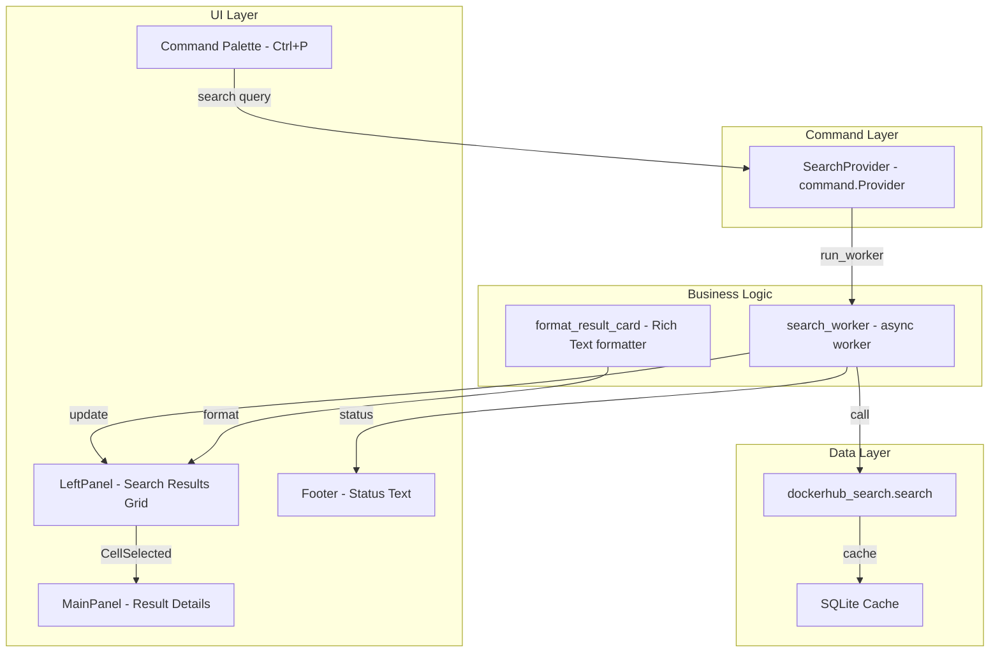

# Search Wiring Plan - Docker Hub Search to Command Palette

## Overview

Wire the existing Docker Hub search module to the Textual command palette, display results in a 4-column card grid in the left panel, and show selected result details in the main panel.

---

## IMPORTANT: Coding Standards for All Tasks

These standards MUST be followed for every subtask:

### 1. Module Size Limit
- **Maximum 100 lines of code per file**
- If code exceeds 100 lines, split into submodules
- Each module should have a single, clear responsibility

### 2. Project Structure Alignment
- New code MUST be organized into subfolders matching existing project structure
- Follow the established pattern: `app/core/`, `app/ui/`, `app/modules/`
- UI components go in `app/ui/` with appropriate subfolders (`commands/`, `widgets/`, etc.)

### 3. Textual Documentation Access
- **All agents have access to `textual-mcp`** for Textual framework documentation
- Use `mcp--textual-mcp--search_textual_documentation` to look up Textual patterns
- Use `mcp--textual-mcp--search_textual_code` to find code examples
- Consult documentation before implementing any Textual-specific features

### 4. Clean Code Principles
- Clear, descriptive function and variable names
- Type hints on all function signatures
- Docstrings for all classes and public methods
- Imports organized: stdlib, third-party, local

---

## Architecture Diagram



## User Journey

1. User presses `Ctrl+P` to open command palette
2. User types `search homedepot` (IRC-style command)
3. Command palette closes, footer shows status text: `Searching for homedepot...`
4. Results populate left panel as 4-column grid of cards
5. Footer updates: `Found 42 results for homedepot`
6. User navigates with arrow keys, selects a card with Enter
7. Selected result details appear in main panel

---

## Task 1: Create Search Command Provider

**File:** `app/ui/commands/search_provider.py` (new file)

**Purpose:** Handle `search <query>` commands from the command palette.

### Subtask 1.1: Create the provider module structure

Create the directory and file:
```
app/ui/__init__.py (new)
app/ui/commands/__init__.py (new)
app/ui/commands/search_provider.py (new)
```

### Subtask 1.2: Implement SearchProvider class

The provider should parse IRC-style `search <query>` commands.

```python
"""Search command provider for the command palette."""

from __future__ import annotations

from textual.command import Provider, Hit, Hits, DiscoveryHit
from typing import TYPE_CHECKING

if TYPE_CHECKING:
    from textual.app import App


class SearchProvider(Provider):
    """Provides 'search <query>' command to search Docker Hub."""

    @property
    def _app(self) -> App:
        """Get the app instance."""
        return self.screen.app

    async def discover(self) -> Hits:
        """Show the search command when palette opens."""
        yield DiscoveryHit(
            display="search <query>",
            command=self._no_op,
            help="Search Docker Hub. Example: search nginx",
        )

    async def _no_op(self) -> None:
        """Placeholder - discover hits just show help text."""
        pass

    async def search(self, query: str) -> Hits:
        """Parse and handle search commands."""
        query = query.strip()
        
        # Check if input starts with 'search '
        if query.lower().startswith("search "):
            search_term = query[7:].strip()  # Remove 'search ' prefix
            if search_term:
                yield Hit(
                    score=100,  # High score to appear at top
                    match_display=f"Search Docker Hub for: {search_term}",
                    command=lambda term=search_term: self._execute_search(term),
                    help=f"Search Docker Hub for '{search_term}'",
                )
        elif query.lower() == "search":
            # User typed just "search" - show hint
            yield Hit(
                score=50,
                match_display="search <query>",
                command=self._no_op,
                help="Type a search term after 'search'. Example: search nginx",
            )

    async def _execute_search(self, search_term: str) -> None:
        """Trigger the search on the app."""
        # Post a custom message to the app to trigger the search
        from app.ui.messages import SearchRequested
        self._app.post_message(SearchRequested(query=search_term))
```

### Subtask 1.3: Create custom message for search requests

**File:** `app/ui/messages.py` (new file)

```python
"""Custom messages for the dockerDorker UI."""

from textual.message import Message


class SearchRequested(Message):
    """Posted when user requests a Docker Hub search."""
    
    def __init__(self, query: str) -> None:
        self.query = query
        super().__init__()


class SearchComplete(Message):
    """Posted when search results are ready."""
    
    def __init__(self, query: str, results: list, total: int, cached: bool) -> None:
        self.query = query
        self.results = results
        self.total = total
        self.cached = cached
        super().__init__()


class SearchError(Message):
    """Posted when search fails."""
    
    def __init__(self, query: str, error: str) -> None:
        self.query = query
        self.error = error
        super().__init__()
```

---

## Task 2: Create Search Results Widget

**File:** `app/ui/widgets/search_results.py` (new file)

**Purpose:** Display search results in a 4-column DataTable with card-style cells.

### Subtask 2.1: Create widget directory structure

```
app/ui/widgets/__init__.py (new)
app/ui/widgets/search_results.py (new)
```

### Subtask 2.2: Implement the SearchResultsWidget

```python
"""Search results grid widget."""

from __future__ import annotations

from rich.console import RenderableType
from rich.text import Text
from textual.widgets import DataTable
from textual.coordinate import Coordinate
from typing import Any, Dict, List, Optional


class SearchResultsWidget(DataTable):
    """A 4-column grid displaying Docker Hub search results as cards."""

    COLUMNS = 4  # Number of cards per row

    def __init__(self, **kwargs) -> None:
        super().__init__(
            show_header=False,
            cursor_type="cell",
            zebra_stripes=False,
            **kwargs,
        )
        self._results: List[Dict[str, Any]] = []
        self._current_page = 1
        self._total_pages = 1
        self._query = ""

    def on_mount(self) -> None:
        """Set up the table columns on mount."""
        # Add 4 columns with equal width (no headers shown)
        for i in range(self.COLUMNS):
            self.add_column(f"col{i}", width=None)

    def load_results(
        self,
        results: List[Dict[str, Any]],
        query: str,
        page: int = 1,
        total_pages: int = 1,
    ) -> None:
        """Load search results into the grid."""
        self._results = results
        self._query = query
        self._current_page = page
        self._total_pages = total_pages
        self._populate_grid()

    def _populate_grid(self) -> None:
        """Populate the DataTable with result cards."""
        self.clear()
        
        if not self._results:
            return

        # Group results into rows of 4
        for i in range(0, len(self._results), self.COLUMNS):
            row_results = self._results[i:i + self.COLUMNS]
            row_cells = []
            
            for result in row_results:
                card = self._format_card(result)
                row_cells.append(card)
            
            # Pad with empty cells if row is incomplete
            while len(row_cells) < self.COLUMNS:
                row_cells.append(Text(""))
            
            # Add row with the result name as key for later retrieval
            first_name = row_results[0].get("name", "") if row_results else ""
            self.add_row(*row_cells, key=f"row_{i}")

    def _format_card(self, result: Dict[str, Any]) -> RenderableType:
        """Format a single result as a Rich Text card."""
        name = result.get("name", "unknown")
        publisher = result.get("publisher", "")
        updated_at = result.get("updated_at", "")
        star_count = result.get("star_count", 0) or 0
        pull_count = result.get("pull_count", 0) or 0
        description = result.get("short_description", "") or ""
        
        # Format display name
        if publisher and publisher != name.split("/")[0]:
            display_name = f"{publisher}/{name}"
        else:
            display_name = name
        
        # Format date (extract just the date part)
        if updated_at and "T" in str(updated_at):
            date_str = str(updated_at).split("T")[0]
        else:
            date_str = str(updated_at)[:10] if updated_at else "N/A"
        
        # Format pull count with K/M/B suffix
        pulls_str = self._format_count(pull_count)
        
        # Truncate description
        max_desc_len = 35
        if len(description) > max_desc_len:
            description = description[:max_desc_len - 3] + "..."
        
        # Build the card text
        card = Text()
        card.append(display_name[:25], style="bold cyan")  # Row 1: name
        card.append("\n")
        card.append(f"Updated: {date_str}", style="dim")  # Row 2: date
        card.append("\n")
        card.append(f"* {star_count} ", style="yellow")  # Row 3: stats
        card.append(f"Pulls: {pulls_str}", style="green")
        card.append("\n")
        card.append(description, style="italic dim")  # Row 4: description
        
        return card

    def _format_count(self, count: int) -> str:
        """Format large numbers with K/M/B suffix."""
        if count >= 1_000_000_000:
            return f"{count / 1_000_000_000:.1f}B"
        if count >= 1_000_000:
            return f"{count / 1_000_000:.1f}M"
        if count >= 1_000:
            return f"{count / 1_000:.1f}K"
        return str(count)

    def get_selected_result(self) -> Optional[Dict[str, Any]]:
        """Get the currently selected result data."""
        if not self._results:
            return None
        
        coord = self.cursor_coordinate
        # Calculate the index in the flat results list
        result_index = (coord.row * self.COLUMNS) + coord.column
        
        if 0 <= result_index < len(self._results):
            return self._results[result_index]
        return None

    @property
    def page_info(self) -> str:
        """Return current page info string: 'Page X/YYY'"""
        return f"Page {self._current_page:3d}/{self._total_pages:3d}"
```

---

## Task 3: Create Result Details Widget

**File:** `app/ui/widgets/result_details.py` (new file)

**Purpose:** Display detailed information about a selected search result.

### Subtask 3.1: Implement ResultDetailsWidget

```python
"""Result details widget for the main panel."""

from __future__ import annotations

from rich.console import RenderableType
from rich.panel import Panel
from rich.table import Table
from rich.text import Text
from textual.widgets import Static
from typing import Any, Dict, Optional


class ResultDetailsWidget(Static):
    """Displays detailed information about a selected Docker Hub result."""

    def __init__(self, **kwargs) -> None:
        super().__init__("Select a search result to view details", **kwargs)
        self._result: Optional[Dict[str, Any]] = None

    def show_result(self, result: Dict[str, Any]) -> None:
        """Display details for the given result."""
        self._result = result
        self.update(self._format_details(result))

    def clear_result(self) -> None:
        """Clear the displayed result."""
        self._result = None
        self.update("Select a search result to view details")

    def _format_details(self, result: Dict[str, Any]) -> RenderableType:
        """Format result details as a Rich renderable."""
        name = result.get("name", "unknown")
        publisher = result.get("publisher", "")
        slug = result.get("slug", name)
        updated_at = result.get("updated_at", "N/A")
        created_at = result.get("created_at", "N/A")
        star_count = result.get("star_count", 0) or 0
        pull_count = result.get("pull_count", 0) or 0
        description = result.get("short_description", "") or "No description"
        os_list = result.get("operating_systems", []) or []
        arch_list = result.get("architectures", []) or []

        # Build info table
        table = Table(show_header=False, box=None, padding=(0, 1))
        table.add_column("Field", style="bold")
        table.add_column("Value")

        # Display name
        display_name = f"{publisher}/{name}" if publisher else name
        table.add_row("Repository", Text(display_name, style="bold cyan"))
        table.add_row("Slug", slug)
        table.add_row("Publisher", publisher or "N/A")
        table.add_row("", "")  # Spacer
        table.add_row("Stars", Text(str(star_count), style="yellow"))
        table.add_row("Pulls", Text(self._format_count(pull_count), style="green"))
        table.add_row("", "")  # Spacer
        table.add_row("Created", self._format_date(created_at))
        table.add_row("Updated", self._format_date(updated_at))
        table.add_row("", "")  # Spacer
        
        if os_list:
            table.add_row("OS", ", ".join(os_list[:5]))
        if arch_list:
            table.add_row("Arch", ", ".join(arch_list[:5]))

        # Create panel with description as subtitle
        content = Text()
        content.append_text(Text.from_markup(f"[italic]{description}[/italic]"))
        content.append("\n\n")
        
        # We need to render table separately
        from rich.console import Console
        from io import StringIO
        string_io = StringIO()
        console = Console(file=string_io, force_terminal=True)
        console.print(table)
        content.append(string_io.getvalue())

        return Panel(
            content,
            title=f"[bold]{display_name}[/bold]",
            border_style="cyan",
        )

    def _format_count(self, count: int) -> str:
        """Format large numbers with K/M/B suffix."""
        if count >= 1_000_000_000:
            return f"{count / 1_000_000_000:.1f}B"
        if count >= 1_000_000:
            return f"{count / 1_000_000:.1f}M"
        if count >= 1_000:
            return f"{count / 1_000:.1f}K"
        return str(count)

    def _format_date(self, date_val: Any) -> str:
        """Format a date value for display."""
        if not date_val or date_val == "N/A":
            return "N/A"
        date_str = str(date_val)
        if "T" in date_str:
            return date_str.split("T")[0]
        return date_str[:10]
```

---

## Task 4: Create Pagination Navigation Widget

**File:** `app/ui/widgets/pagination.py` (new file)

**Purpose:** Display `< Page X/YYY >` navigation controls.

### Subtask 4.1: Implement PaginationWidget

```python
"""Pagination navigation widget."""

from __future__ import annotations

from textual.widgets import Static
from textual.message import Message
from textual.reactive import reactive


class PaginationWidget(Static):
    """Displays pagination controls: < Page X/YYY >"""

    current_page: reactive[int] = reactive(1)
    total_pages: reactive[int] = reactive(1)

    class PageChanged(Message):
        """Posted when user navigates to a different page."""
        def __init__(self, page: int) -> None:
            self.page = page
            super().__init__()

    def __init__(self, **kwargs) -> None:
        super().__init__(**kwargs)
        self._visible = False

    def on_mount(self) -> None:
        """Initial render."""
        self._update_display()

    def watch_current_page(self, page: int) -> None:
        """React to page changes."""
        self._update_display()

    def watch_total_pages(self, total: int) -> None:
        """React to total pages changes."""
        self._update_display()

    def _update_display(self) -> None:
        """Update the displayed text."""
        if not self._visible or self.total_pages <= 1:
            self.update("")
            return
        
        # Format: < Page   1/123 >
        # Using 3-digit width for page numbers
        self.update(f"< Page {self.current_page:3d}/{self.total_pages:3d} >")

    def show(self, current: int, total: int) -> None:
        """Show pagination with given values."""
        self._visible = True
        self.current_page = current
        self.total_pages = total

    def hide(self) -> None:
        """Hide pagination."""
        self._visible = False
        self.update("")

    def next_page(self) -> None:
        """Navigate to next page if available."""
        if self.current_page < self.total_pages:
            self.current_page += 1
            self.post_message(self.PageChanged(self.current_page))

    def prev_page(self) -> None:
        """Navigate to previous page if available."""
        if self.current_page > 1:
            self.current_page -= 1
            self.post_message(self.PageChanged(self.current_page))
```

---

## Task 5: Update Main App with Search Integration

**File:** `app.py` (modify existing)

**Purpose:** Integrate all components into the main application.

### Subtask 5.1: Add imports and COMMANDS class var

```python
"""
dockerDorkerUI

A basic UI structure with:
- Header (docked top)
- Top Panel (1/3)
- Left/Right Panels (50/50 split, 2/3 height)
- Footer (docked bottom)
"""

from textual.app import App, ComposeResult
from textual.containers import Horizontal, Vertical
from textual.widgets import Header, Footer, Static
from textual.work import work

# Import new UI components
from app.ui.commands.search_provider import SearchProvider
from app.ui.messages import SearchRequested, SearchComplete, SearchError
from app.ui.widgets.search_results import SearchResultsWidget
from app.ui.widgets.result_details import ResultDetailsWidget
from app.ui.widgets.pagination import PaginationWidget

# Import search API
from app.core.api.dockerhub_search import search as dockerhub_search
```

### Subtask 5.2: Update panel classes

```python
class TopPanel(Static):
    """Top panel widget - contains pagination."""
    pass


class LeftPanel(Static):
    """Left panel widget - contains search results."""
    
    def compose(self) -> ComposeResult:
        yield PaginationWidget(id="pagination")
        yield SearchResultsWidget(id="search-results")


class RightPanel(Static):
    """Right panel widget - contains result details."""
    
    def compose(self) -> ComposeResult:
        yield ResultDetailsWidget(id="result-details")
```

### Subtask 5.3: Update DockerDorkerApp class

```python
class DockerDorkerApp(App):
    """dockerDorker - A Textual app with a basic UI layout."""

    CSS_PATH = "app/styles/styles.tcss"
    TITLE = "dockerDorker"
    SUB_TITLE = "by @thesavant42"
    
    # Register the search command provider
    COMMANDS = App.COMMANDS | {SearchProvider}

    def compose(self) -> ComposeResult:
        """Compose the UI layout."""
        yield Header(show_clock=True)
        yield TopPanel("dockerDorker", id="top-panel")
        with Horizontal(id="main-content"):
            yield LeftPanel(id="left-panel")
            yield RightPanel(id="right-panel")
        yield Footer()

    def on_mount(self) -> None:
        """Set the Dracula theme when the app mounts."""
        self.theme = "dracula"
        self._status_text = ""

    # --- Search Message Handlers ---

    def on_search_requested(self, message: SearchRequested) -> None:
        """Handle search request from command palette."""
        self._set_status(f"Searching for '{message.query}'...")
        self._run_search(message.query)

    @work(exclusive=True, thread=True)
    def _run_search(self, query: str) -> None:
        """Run the search in a background thread."""
        try:
            # Call the existing search function
            results = dockerhub_search(query, progress_callback=self._search_progress)
            
            # Post results back to main thread
            self.call_from_thread(
                self.post_message,
                SearchComplete(
                    query=query,
                    results=results.get("results", []),
                    total=results.get("total", 0),
                    cached=results.get("cached", False),
                )
            )
        except Exception as e:
            self.call_from_thread(
                self.post_message,
                SearchError(query=query, error=str(e))
            )

    def _search_progress(self, message: str, current: int, total: int) -> None:
        """Progress callback for search - updates status text."""
        self.call_from_thread(self._set_status, message)

    def on_search_complete(self, message: SearchComplete) -> None:
        """Handle search completion."""
        cached_text = " (cached)" if message.cached else ""
        self._set_status(f"Found {message.total} results for '{message.query}'{cached_text}")
        
        # Update the search results widget
        results_widget = self.query_one("#search-results", SearchResultsWidget)
        total_pages = (len(message.results) + 3) // 4  # 4 results per row
        results_widget.load_results(
            results=message.results,
            query=message.query,
            page=1,
            total_pages=max(1, total_pages),
        )
        
        # Show pagination
        pagination = self.query_one("#pagination", PaginationWidget)
        pagination.show(1, max(1, total_pages))

    def on_search_error(self, message: SearchError) -> None:
        """Handle search errors."""
        self._set_status(f"Search failed: {message.error}")

    def _set_status(self, text: str) -> None:
        """Update status text in footer area."""
        self._status_text = text
        # Update the sub_title to show status
        self.sub_title = text if text else "by @thesavant42"

    # --- Result Selection Handler ---

    def on_data_table_cell_selected(self, event: DataTable.CellSelected) -> None:
        """Handle cell selection in search results."""
        results_widget = self.query_one("#search-results", SearchResultsWidget)
        selected = results_widget.get_selected_result()
        
        if selected:
            details_widget = self.query_one("#result-details", ResultDetailsWidget)
            details_widget.show_result(selected)
```

---

## Task 6: Update Styles

**File:** `app/styles/styles.tcss` (modify existing)

**Purpose:** Add styles for new widgets.

### Subtask 6.1: Add styles for search results and pagination

```css
/* dockerDorker Stylesheet */

/* Screen uses vertical layout by default - widgets stack top to bottom */

/* Header styling - built-in widget with dock:top */
/* No additional styling needed - Header has its own internal CSS */

/* Top panel - flows below header in vertical layout (not docked) */
#top-panel {
    height: 1fr;
    padding: 1 2;
    background: $surface;
    border: solid $primary;
}

/* Main content area - horizontal split for left/right panels */
#main-content {
    height: 2fr;
}

/* Left panel - 50% width, contains search results */
#left-panel {
    width: 1fr;
    height: 100%;
    padding: 0;
    background: $surface;
    border: solid $secondary;
    layout: vertical;
}

/* Right panel - 50% width, contains result details */
#right-panel {
    width: 1fr;
    height: 100%;
    padding: 1 2;
    background: $surface;
    border: solid $secondary;
}

/* Footer styling - uses built-in dock:bottom */
Footer {
    dock: bottom;
}

/* Pagination widget */
#pagination {
    height: 1;
    padding: 0 1;
    text-align: center;
    background: $surface-darken-1;
    color: $text-muted;
}

/* Search results DataTable */
#search-results {
    height: 1fr;
    scrollbar-size: 1 1;
}

/* DataTable cell styling for cards */
#search-results > .datatable--cursor {
    background: $accent;
}

/* Result details widget */
#result-details {
    height: 100%;
    overflow-y: auto;
}
```

---

## Task 7: Create __init__.py Files

**Purpose:** Make new modules importable.

### Subtask 7.1: Create app/ui/__init__.py

```python
"""UI components for dockerDorker."""
```

### Subtask 7.2: Create app/ui/commands/__init__.py

```python
"""Command palette providers."""

from app.ui.commands.search_provider import SearchProvider

__all__ = ["SearchProvider"]
```

### Subtask 7.3: Create app/ui/widgets/__init__.py

```python
"""Custom widgets for dockerDorker."""

from app.ui.widgets.search_results import SearchResultsWidget
from app.ui.widgets.result_details import ResultDetailsWidget
from app.ui.widgets.pagination import PaginationWidget

__all__ = ["SearchResultsWidget", "ResultDetailsWidget", "PaginationWidget"]
```

---

## Implementation Checklist

- [ ] **Task 1:** Create Search Command Provider
  - [ ] 1.1: Create directory structure (`app/ui/commands/`)
  - [ ] 1.2: Implement `SearchProvider` class
  - [ ] 1.3: Create `app/ui/messages.py` with custom messages

- [ ] **Task 2:** Create Search Results Widget
  - [ ] 2.1: Create directory structure (`app/ui/widgets/`)
  - [ ] 2.2: Implement `SearchResultsWidget` class

- [ ] **Task 3:** Create Result Details Widget
  - [ ] 3.1: Implement `ResultDetailsWidget` class

- [ ] **Task 4:** Create Pagination Widget
  - [ ] 4.1: Implement `PaginationWidget` class

- [ ] **Task 5:** Update Main App
  - [ ] 5.1: Add imports
  - [ ] 5.2: Update panel classes with compose methods
  - [ ] 5.3: Add message handlers and worker to `DockerDorkerApp`

- [ ] **Task 6:** Update Styles
  - [ ] 6.1: Add CSS for new widgets

- [ ] **Task 7:** Create __init__.py Files
  - [ ] 7.1: `app/ui/__init__.py`
  - [ ] 7.2: `app/ui/commands/__init__.py`
  - [ ] 7.3: `app/ui/widgets/__init__.py`

- [ ] **Task 8:** Testing
  - [ ] 8.1: Run app and press Ctrl+P
  - [ ] 8.2: Type `search nginx` and verify results appear
  - [ ] 8.3: Navigate with arrow keys and verify selection updates details
  - [ ] 8.4: Verify status text shows in subtitle during search

---

## File Summary

| File | Action | Purpose |
|------|--------|---------|
| `app/ui/__init__.py` | Create | Package init |
| `app/ui/messages.py` | Create | Custom Textual messages |
| `app/ui/commands/__init__.py` | Create | Package init |
| `app/ui/commands/search_provider.py` | Create | Command palette provider |
| `app/ui/widgets/__init__.py` | Create | Package init |
| `app/ui/widgets/search_results.py` | Create | 4-column card grid |
| `app/ui/widgets/result_details.py` | Create | Details panel |
| `app/ui/widgets/pagination.py` | Create | Page navigation |
| `app.py` | Modify | Integrate all components |
| `app/styles/styles.tcss` | Modify | Add widget styles |

---

## Notes for Programming Agent

1. **Status Text Location:** Status is shown by updating `app.sub_title` rather than adding a separate widget to footer. This avoids disrupting the existing footer.

2. **Thread Safety:** The search uses `@work(thread=True)` because `dockerhub_search` is synchronous. Use `call_from_thread()` for any UI updates from the worker.

3. **DataTable Import:** When handling `CellSelected`, you need to import DataTable:
   ```python
   from textual.widgets import DataTable
   ```

4. **Testing Command:** To test, run `python app.py`, press `Ctrl+P`, and type `search nginx`.

5. **Existing Search API:** The search function at `app/core/api/dockerhub_search.py` already handles caching and pagination. Do not modify it.
